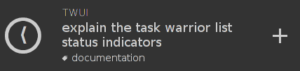

# twui

Taskwarrior UI - a responsive web interface to [taskwarrior](http://taskwarrior.org/).

 

## Installing

Download executable from "releases" and put in `/usr/local/bin`

## Usage

To start simply type `twui` and navigate to `localhost:2718`.

If you want twui to run as a background process use the following:

    twui &>/dev/null &

## UI

### Task Summary

The task summary contains six indicators for the following attributes of a task.

- Description - the majority of text displayed ("explain the task warrior list status indicators")
- Project - the text displayed in thin caps below the description ("TWUI")
- Tags - text prefixed with a 'tag' image ("documentation")
- Due Date - if the task has a due date 'hands' will appear in the circle to the left of the description (like a clock)
- Recurring - if the task has a second ring it is a recurring task.
- Annotations - if the task has annotations a count will occur to the right of the description ('[2]')
- Priority - indicated by color
    + grey - no priority
    + blue - low priority
    + green - medium priority
    + red - high priority

## Contributing

### Setting up the development environment

0. Install go [http://golang.org/](http://golang.org/)
1. Clone the repo `git clone https://github.com/rampantmonkey/twui.git`
2. Move to directory `cd twui`
3. Compile code `make`
4. Start server `bin/twui`

### Updating to most recent version

1. Download latest changes `git pull origin master`
2. Compile code `make`
3. Start server `bin/twui`

## License
_This software is released under the WTFPL._
You can find a copy in [LICENSE.txt](LICENSE.txt) or at [wtfpl.net](http://www.wtfpl.net/txt/copying/).
